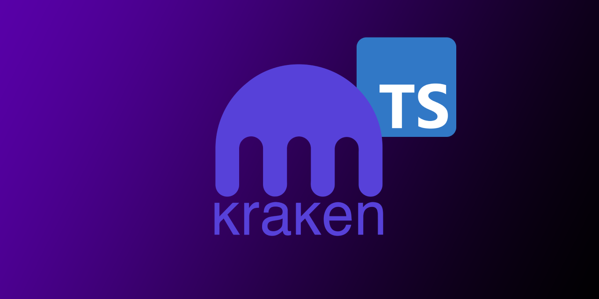
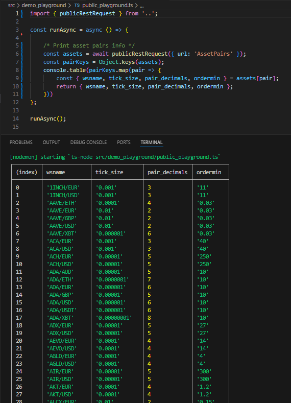
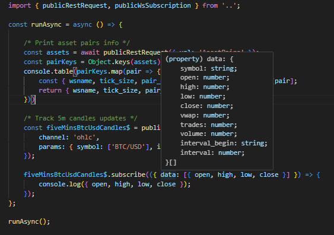

<div style="display: flex; justify-content: space-between;">
  
  
  
</div>

<h1 align="center">
  <br>
  
</h1>

<br /><br />

<h4 align="center">A <i>strongly typed library</i> to operate with the <a href="https://kraken.com">Kraken Crypto Exchange</a></h4>
<br />

<p align="center">
  <a href="#-quick-start">Quick-Start</a> •
  <a href="#ℹ%EF%B8%8F-about-this-project">About</a> •
  <a href="#%EF%B8%8F-usage">Usage</a> •
  <a href="#-documentation">Documentation</a> •
  <a href="#-acknowledgments">Acknowledgments</a>
</p>

<br />

## 🚀 Quick-Start
<details><summary>(click to extend 👇)</summary>

- Add the dependency to your js/ts project: `npm i ts-kraken`

- _Optionally_ add `KRAKEN_API_KEY` and `KRAKEN_API_SECRET` to your .env (only if you intend to use private methods, i.e. add orders or fetch balances)

- Test the repl-cli with `npx ts-kraken` or find code-snippets examples for the methods you want to import in [the documentation](https://yeikiu.github.io/ts-kraken).

```ts
import {
  getClosedOrders,
  getWsAuthToken,
  privateWsSubscription,
  publicWsSubscription
} from 'ts-kraken'

getWsAuthToken()
  .then(async token => {
    console.log({ token })

    /* Fetch latest 50 closed orders and logs them */
    getClosedOrders().then(lastClosedOrdersArr => {
      const closedOrders = lastClosedOrdersArr.map(
        ({ orderid, descr: { order } }) => ({ orderid, order })
      )

      console.table(closedOrders)
    })

    /* Print any updates in the private `balances` channel */
    const balances$ = await privateWsSubscription(
      {
        channel: 'balances',
        params: { snapshot: true }
      },
      token
    ) // Pass token here to save time as the library won't need to fetch one internally!

    balances$.subscribe(({ data }) => {
      console.table(data)
    })

    /* Track 5m candles updates */
    const fiveMinsBtcUsdCandles$ = publicWsSubscription({
      channel: 'ohlc',
      params: { symbol: ['BTC/USD'], interval: 5, snapshot: false }
    })

    fiveMinsBtcUsdCandles$.subscribe(
      ({ data: [{ open, high, low, close }] }) => {
        console.log({ open, high, low, close })
      }
    )
  })
  .catch(error => {
    console.log({ error })
  })
```

</details>

<br />

## ℹ️ About this project 
<details><summary>(click to extend 👇)</summary>

> **ts-kraken** is a **strongly-typed** _Typescript Library_ that will help you
> operating via code or shell with
> [the Kraken Crypto Exchange](https://kraken.com)

- Easily operate with Kraken
  [REST](https://docs.kraken.com/api/docs/category/rest-api/market-data) and
  [WebSocketV2](https://docs.kraken.com/websockets/) APIs

- Use
  [`ts-kraken` helper methods](https://yeikiu.github.io/ts-kraken/functions/getClosedOrders.html)
  to build your own trading bots

- Subscribe to custom streams of data combining the RxJS Observables returned by
  the WebsocketV2 methods

- Get advantage of modern IDEs Typescript integrations (code autocompletion,
  suggested imports, etc.)

<br />

> It also features an **interactive _node REPL-cli_** to operate via
> command-shell or leave a socket open printing all updates to the terminal with
> a nice [jq](https://jqlang.github.io/jq/) format 🤓

- Kraken UI down durig high traffic or maintenance? You can still use the APIs!

- Use any of the available REST methods directly from your terminal

- Print nicely formatted data updates coming directly from WebsocketV2
  subscriptions
</details>

<br />

## 🛠️ Usage 
<details><summary>(click to extend 👇)</summary>

  #### Use the library in your TypeScript/JS project:
  <details open><summary>(click to extend 👇)</summary>

  - `cd dependant/project/path && npm i ts-kraken`

  

  <br />

  > Get _IDE code-suggestions_ for any REST or WS request you need

  

</details>

  #### Use the REPL-cli
  <details><summary>(click to extend 👇)</summary>

  > You can create a `.env` file that the repl-cli will try to read from `cwd`
  > (current working directory):

  - `touch .env`

  Use the following format:

  ```
  # .env's file content holding your API key/secret

  KRAKEN_API_KEY=yourApiKey
  KRAKEN_API_SECRET=yourApiSecret
  ```

  <br />

  ##### Launch the REPL directly on your terminal with `npx`:

  > Quickest way to test it! 🚀 (will automatically download the library as a
  > global npm package if you don't run `npm i ts-kraken` first)

  - `npx ts-kraken`

  <br />

  ##### Set it up in a standalone directory:

  > Recommended if planning to use regularly and/or modify core functionality

  - `git clone https://github.com/yeikiu/ts-kraken`

  - `cd ts-kraken`

  - `npm i`

  - `npm run repl` or `npx kraken-repl`

  > Open a PR with any addition/change proposal you have!

  

  <br />

  ##### REPL commands
  <details><summary>(click to extend 👇)</summary>

  > The following list includes only a subset sample of all possible commands you
  > could generate for the .get and .post methods:

  <br />

  ```
  .exit       👉 Exit the REPL

  -----------------------------------------------------------------------------------------------------------------------------------------------------

  .help       👉 Print this help message

  -----------------------------------------------------------------------------------------------------------------------------------------------------

  .get        👉 Fetch PUBLIC REST data.

              Usage   >> .get <PublicEndpoint>! <paramA=valueA&param_list[]=value1&param_list[]=value2>? <jqFilter>? <-table>?

              i.e.    >> .get Time .rfc1123
                      >> .get AssetPairs . as $base|keys|map($base[.])|map({wsname,tick_size,pair_decimals,ordermin}) -table
                      >> .get AssetPairs pair=BTC/EUR . as $base|keys[0]|$base[.]|{wsname,tick_size,pair_decimals,ordermin}

  -----------------------------------------------------------------------------------------------------------------------------------------------------

  .post       👉 Fetch PRIVATE REST data.

              Usage   >> .post <PrivateEndpoint>! <paramA=valueA&param_list[]=value1&param_list[]=value2>? <jqFilter>? <-table>?

              i.e.    >> .post OpenOrders .open as $open|.open|keys|map($open[.].descr.order)
                      >> .post OpenOrders .open as $open|.open|keys|map($open[.].descr) -table
                      >> .post AddOrder ordertype=market&type=sell&volume=0.002&pair=ETHEUR
                      >> .post CancelAll

  -----------------------------------------------------------------------------------------------------------------------------------------------------

  .privsub    👉 Subscribe to PRIVATE WS stream.

              Usage   >> .privsub <subscriptionName>! <paramA=valueA&param_list[]=value1&param_list[]=value2>? <jqFilter>? <-table>?

              i.e.    >> .privsub balances snap_orders=true .data|map({ asset, balance }) -table
                      >> .privsub executions snap_orders=true .data|map({order_id,side,order_qty,symbol,order_type,limit_price}) -table

  .pubsub     👉 Subscribe to PUBLIC WS stream.

              Usage   >> .pubsub <subscriptionName>! <paramA=valueA&param_list[]=value1&param_list[]=value2>? <jqFilter>? <-table>?

              i.e.    >> .pubsub ticker symbol[]=BTC/EUR .data[0].last
                      >> .pubsub ticker symbol[]=BTC/EUR&symbol[]=ADA/BTC&symbol[]=USDT/USD .data[0]|{symbol,last} -table

  -----------------------------------------------------------------------------------------------------------------------------------------------------

  .setkeys    👉 Load API key/secret (non-persistent, use a .env file to reuse persistent keys)

  .showkeys   👉 Display current API key/secret in use

  -----------------------------------------------------------------------------------------------------------------------------------------------------

  .unsub      👉 Closes WebSocket stream for GIVEN subscriptionName.

              i.e.    >> .unsub ticker
                      >> .unsub executions

  .unsuball   👉 Closes WebSocket stream for ALL subscriptions.

              i.e.    >> .unsuball
  ```

  </details>
</details>
</details>

<br />

## 🔖 Documentation

- [ts-kraken Documentation](https://yeikiu.github.io/ts-kraken)

- [Kraken REST API docs](https://docs.kraken.com/api/docs/rest-api/add-order)
- [Kraken WebSocketsV2 API docs](https://docs.kraken.com/api/docs/websocket-v2/add_order)

- [jq Manual](https://stedolan.github.io/jq/manual)
- [jq Playground](https://jqkungfu.com/)

<br />

## 🙏 Acknowledgments

- [@trasherdk](https://github.com/trasherdk) | Contributor
