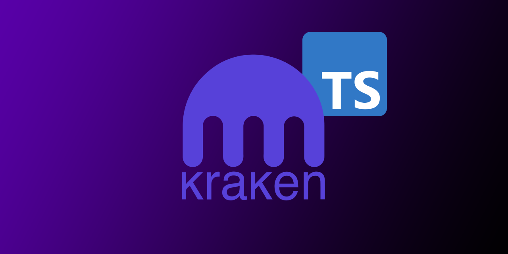
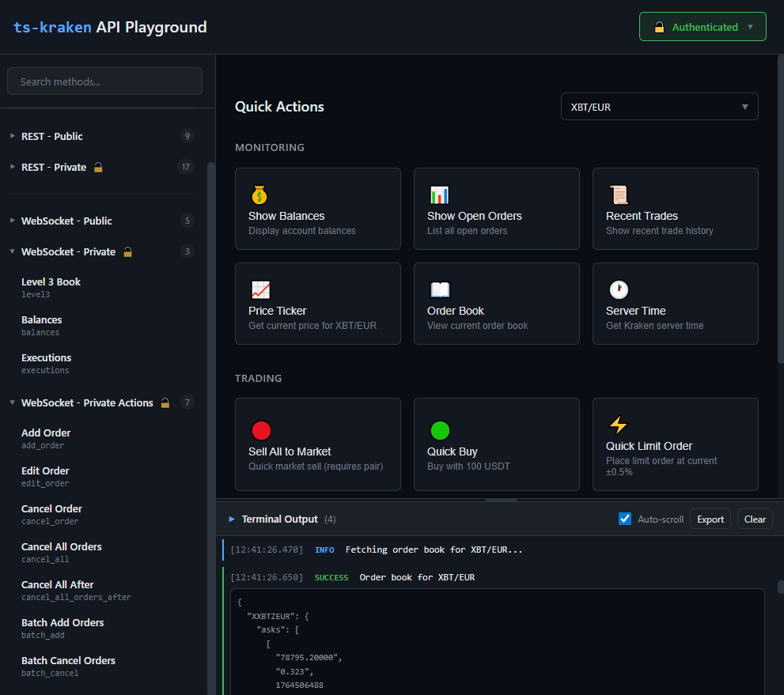
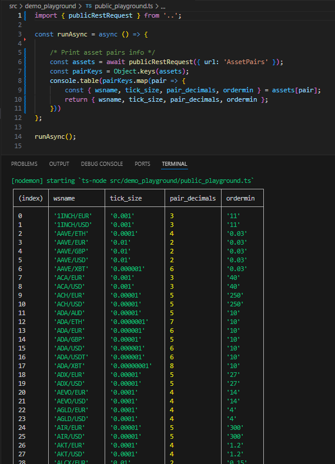
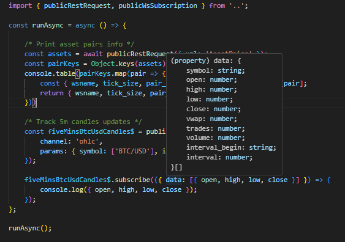

<div style="display: flex; justify-content: space-between;">
  
  
  
</div>

<h1 align="center">
  <br>
  
</h1>

<h3 align="center">🦑 Strongly-Typed TypeScript SDK for Kraken Exchange</h3>

<p align="center">
  <strong>REST & WebSocket v2 APIs</strong> • <strong>Node.js & Browser</strong> • <strong>Full Type Safety</strong>
</p>

<p align="center">
  <a href="#-features">Features</a> •
  <a href="#-quick-start">Quick Start</a> •
  <a href="#-interactive-playground">Playground</a> •
  <a href="#-browser--nodejs-support">Browser Support</a> •
  <a href="#-documentation">Documentation</a>
</p>

<br />

---

## ✨ Features

### 🔧 **TypeScript Library**
- ✅ **Full type safety** with IntelliSense autocomplete
- ✅ **REST & WebSocket v2** API support
- ✅ **RxJS observables** for real-time data streams
- ✅ **Helper methods** for common operations (orders, balances, tickers)
- ✅ **Works in Node.js & browsers** (no code changes needed)

### 💻 **Interactive REPL CLI**
- 🚀 Instant access via `npx ts-kraken`
- 🎨 Beautiful terminal output with `jq` formatting
- 🔌 Subscribe to WebSocket streams directly from your shell
- 🔑 Load credentials from `.env` or set interactively

### 🎮 **Web Playground**
- 🌐 **Browser-based API testing interface**
- 📊 Execute REST & WebSocket requests visually
- ⚡ Quick actions for common operations
- 💾 Session-only credential storage (secure)
- 🎯 Perfect when Kraken UI is down or slow!



---

## 🚀 Quick Start

### 📦 Install

```bash
npm install ts-kraken
```

**Optional:** Set up API credentials for private methods (trading, balances, orders):

**Option 1:** Use environment variables in your npm scripts (Node.js only)
```json
{
  "scripts": {
    "start": "KRAKEN_API_KEY=xxx KRAKEN_API_SECRET=yyy node app.js"
  }
}
```

**Option 2:** Use a library like `dotenv` (Node.js only)
```bash
npm install dotenv
```
```env
# .env
KRAKEN_API_KEY=your-api-key-here
KRAKEN_API_SECRET=your-api-secret-here
```
```typescript
import 'dotenv/config';
// Now process.env.KRAKEN_API_KEY is available
```

**Option 3:** Pass credentials directly in code (works in browser & Node.js)
```typescript
// See examples below - credentials passed as second parameter
```

### 🎯 Use in Your Code

> 💡 **Note:** Examples use top-level `await` - requires ES2022+ or async context

```typescript
import {
  publicRestRequest,
  privateRestRequest,
  publicWsSubscription,
  privateWsSubscription
} from 'ts-kraken';

const KRAKEN_API_KEY = 'your-api-key-here';
const KRAKEN_API_SECRET = 'your-api-secret-here';

// 📈 Get BTC/USD ticker (public)
const ticker = await publicRestRequest({
  url: 'Ticker',
  params: { pair: 'XBTUSD' }
});

// 💰 Get account balance (private)
const balance = await privateRestRequest(
  { url: 'Balance' },
  {
    apiKey: KRAKEN_API_KEY,
    apiSecret: KRAKEN_API_SECRET
  } /* Optional runtime override. In NodeJS, process.env values are used if not passed */
);

// 📡 Subscribe to live ticker updates
const ticker$ = publicWsSubscription({
  channel: 'ticker',
  params: { symbol: ['BTC/USD'] }
});

ticker$.subscribe(({ data }) => {
  console.log('Latest price:', data[0].last);
});

// 🔒 Subscribe to private executions feed
const executions$ = await privateWsSubscription(
  {
    channel: 'executions',
    params: { snapshot: true }
  },
  {
    apiKey: KRAKEN_API_KEY,
    apiSecret: KRAKEN_API_SECRET
  } /* Optional runtime override. In NodeJS, process.env values are used if not passed */
);

executions$.subscribe(({ data }) => {
  console.log('Trade executed:', data);
});
```



> 💡 **Full IDE support** with autocomplete for all endpoints, parameters, and response types



---

## 🎮 Interactive Playground

Clone this repo (the built npm package doesn't bring the playground module).

```bash
git clone https://github.com/yeikiu/ts-kraken.git
cd ts-kraken
npm install
```

Launch the **browser-based API playground** to test endpoints visually:

```bash
npm run watch:web-ui
```

**Perfect for:**
- 🔍 Testing API endpoints without writing code
- 📊 Exploring available methods and parameters
- 🚨 Trading when Kraken's official UI is down
- 🎓 Learning the API structure

The playground features:
- **Quick Actions** - Common operations with one click
- **Method Browser** - All REST & WebSocket endpoints organized by category
- **Live Terminal** - See real-time responses
- **Smart Forms** - Auto-generated parameter inputs with validation

---

## 💻 REPL CLI

### Launch Instantly

```bash
npx ts-kraken
```

### Quick Examples

```bash
# 📊 Get current server time
.get Time

# 💱 Get BTC/EUR trading pair info
.get AssetPairs pair=BTC/EUR

# 💰 Check your balances (requires API keys)
.post Balance

# 📈 Subscribe to live BTC/USD ticker
.pubsub ticker symbol[]=BTC/USD

# 🔒 Subscribe to your trade executions
.privsub executions snap_orders=true

# 🛑 Unsubscribe from all streams
.unsuball
```


### REPL Commands Reference

| Command | Description | Example |
|---------|-------------|---------|
| `.get` | Fetch public REST data | `.get Ticker pair=BTC/USD` |
| `.post` | Fetch private REST data | `.post OpenOrders` |
| `.pubsub` | Subscribe to public WebSocket | `.pubsub ticker symbol[]=BTC/USD` |
| `.privsub` | Subscribe to private WebSocket | `.privsub balances` |
| `.unsub` | Unsubscribe from specific channel | `.unsub ticker` |
| `.unsuball` | Unsubscribe from all channels | `.unsuball` |
| `.setkeys` | Set API credentials (session only) | `.setkeys` |
| `.showkeys` | Display current credentials | `.showkeys` |
| `.help` | Show all commands | `.help` |
| `.exit` | Exit the REPL | `.exit` |

**💡 Pro tip:** Use `jq` filters and `-table` flag for formatted output:
```bash
.get AssetPairs . as $base|keys|map($base[.])|map({wsname,tick_size}) -table
```

### Set Up API Keys

Create a `.env` file in your working directory:

```env
KRAKEN_API_KEY=your-api-key-here
KRAKEN_API_SECRET=your-api-secret-here
```

---

## 🌐 Browser & Node.js Support

**ts-kraken v5.0+** works seamlessly in both environments with **zero configuration**.

### How It Works

The library automatically detects your runtime and uses:
- **Node.js**: Native `crypto` module
- **Browser**: Web Crypto API (`crypto.subtle`)

### Browser Requirements

- ✅ Modern browser (Chrome, Firefox, Safari, Edge)
- ✅ ES2020+ support
- ✅ Web Crypto API (built into all modern browsers)

### Browser Security Best Practices

When using ts-kraken in the browser:

⚠️ **NEVER hardcode API keys** in client-side code<br>
✅ Store credentials in **session storage only** (not localStorage)<br>
✅ Use **separate API keys** with limited permissions<br>
✅ Consider using a **backend proxy** for sensitive operations<br>
✅ Be aware that browser code is **visible to users**

### CORS & Proxy Setup

Some Kraken API endpoints may require a proxy due to CORS restrictions. The web playground handles this automatically in development mode.

### Bundler Configuration

Most modern bundlers (Vite, Webpack, etc.) handle Node.js module externalization automatically. No configuration needed!

<details>
<summary>📦 <strong>Vite Configuration (if needed)</strong></summary>

```javascript
// vite.config.ts
export default {
  resolve: {
    alias: {
      crypto: 'crypto-browserify' // fallback if needed
    }
  }
}
```
</details>

---

## 📚 Documentation

### Official Resources

- 📖 [**ts-kraken API Documentation**](https://yeikiu.github.io/ts-kraken) - Full SDK reference
- 🔗 [**Kraken REST API**](https://docs.kraken.com/api/docs/rest-api/add-order) - Official REST docs
- 🔗 [**Kraken WebSocket v2**](https://docs.kraken.com/api/docs/websocket-v2/add_order) - Official WS docs

### Additional Tools

- 🛠️ [**jq Manual**](https://stedolan.github.io/jq/manual) - JSON query language
- 🎮 [**jq Playground**](https://jqkungfu.com/) - Test jq filters online

---

## 🎯 Use Cases

### 🤖 Trading Bots
Build automated trading strategies with full type safety and real-time data streams.

### 📊 Market Analysis
Subscribe to multiple WebSocket feeds and analyze market data in real-time with RxJS operators.

### ⚡ Emergency Trading
Use the REPL or web playground to execute trades when Kraken's UI is experiencing issues.

### 🧪 API Testing
Quickly test and validate Kraken API endpoints before integrating into production.

### 📈 Portfolio Management
Monitor balances, open orders, and trade history with strongly-typed responses.

---

## 🙏 Acknowledgments

- [@trasherdk](https://github.com/trasherdk) - Contributor
- [Kraken Exchange](https://kraken.com) - API documentation and support
- All contributors and users of this library

---

## 📄 License

MIT License - see [LICENSE](LICENSE) file for details

---

## 🔗 Links

- 🐙 [GitHub Repository](https://github.com/yeikiu/ts-kraken)
- 📦 [npm Package](https://www.npmjs.com/package/ts-kraken)
- 📖 [Full Documentation](https://yeikiu.github.io/ts-kraken)
- 🐛 [Report Issues](https://github.com/yeikiu/ts-kraken/issues)

---

<p align="center">
  <strong>Made with 💙 for the Kraken developer community</strong>
</p>
